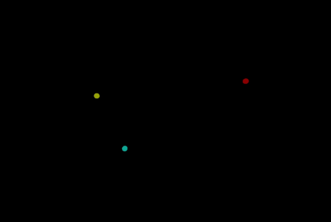

# Planets

## Playing with ThreeJS

## Example: 3 body Problem

## Description

Testing out newtonian and other models of gravity using ThreeJS

## Adjusted for Effect

- Universal Gravitation Constant
- Collision Detections (they're kinda not perfect at the moment)

## Contributors

[@rish-0-0](https://github.com/rish-0-0)
